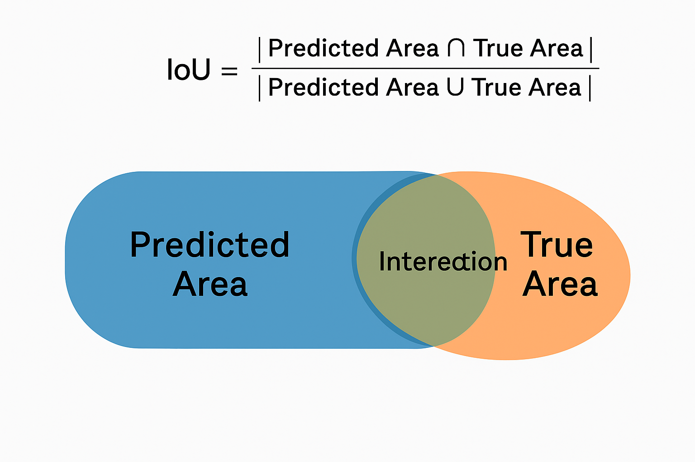

# LiteFacade-UNet

LiteFacade-UNet is a lightweight semantic segmentation project built using a custom U-Net architecture to segment facade images into 12 classes. The model is trained on the `CMP Facade` dataset hosted on Hugging Face and is designed for efficiency and accuracy in architectural image segmentation tasks.

## Files Included

- `litefacade_unet.py`  
  Main script for training the LiteFacade-UNet model. It loads the data, initializes the model, sets callbacks, compiles, trains, and saves the model as `LiteFacade-UNet.h5`.

- `Unet.py`  
  Contains the `Unet` class implementation. It builds the encoder-decoder U-Net architecture with customizable input shape and number of output classes.

- `class_to_data_generator.py`  
  Custom `ImageDataGenerator` class inheriting from `keras.utils.Sequence`. It reads parquet data from Hugging Face, decodes image and label bytes, preprocesses and resizes them, and yields batches for training and evaluation.

- `IOU.png`  
  A visualization of the model's Intersection over Union (IoU) performance metric, showcasing segmentation quality across classes.

## Project Architecture

1. **Data Preparation:**  
   - Data is loaded using `pandas.read_parquet` from the CMP Facade dataset.
   - Images and segmentation masks are encoded in bytes and decoded with PIL.
   - Preprocessing includes resizing to `(224, 224)` and normalizing images to `[0,1]`.

2. **Model Architecture:**  
   - Based on U-Net architecture.
   - Encoder: 4 downsampling blocks with Conv + MaxPool.
   - Bottleneck: Two 1024-channel Conv layers.
   - Decoder: 4 upsampling blocks with transposed convolution and skip connections.
   - Output: 1x1 Conv layer with `softmax` activation for multi-class segmentation.

3. **Training Configuration:**  
   - Optimizer: Adam  
   - Loss: Sparse Categorical Crossentropy  
   - Metrics: Sparse Categorical Accuracy  
   - Callbacks: `EarlyStopping` and `ReduceLROnPlateau`  

4. **Model Output:**  
   - Saved as: `LiteFacade-UNet.h5`  
   - Uploaded on: [Hugging Face Hub](https://huggingface.co/saada2024/LiteFacade-UNet)

## Results

The model achieved solid segmentation results on facade structures with 12 distinct classes. Below is a sample IoU performance visualization:

## Current Limitations

- Relatively small input resolution (`224x224`) may limit fine-grained architectural detail.
- Dataset limited to facade images; generalization to other domains not tested.
- The model currently lacks post-processing or CRF refinement to improve edge accuracy.

## Future Improvements

- Integrate post-processing steps (e.g., Conditional Random Fields) for sharper segmentation boundaries.
- Implement TensorRT or TFLite conversion for deployment on edge devices.
- Experiment with attention mechanisms (e.g., Attention U-Net).
- Augment dataset with diverse facade images to improve generalization.
- Add visualizations for training curves (loss, accuracy).

---

`Documented by [M.A.Saada]`
